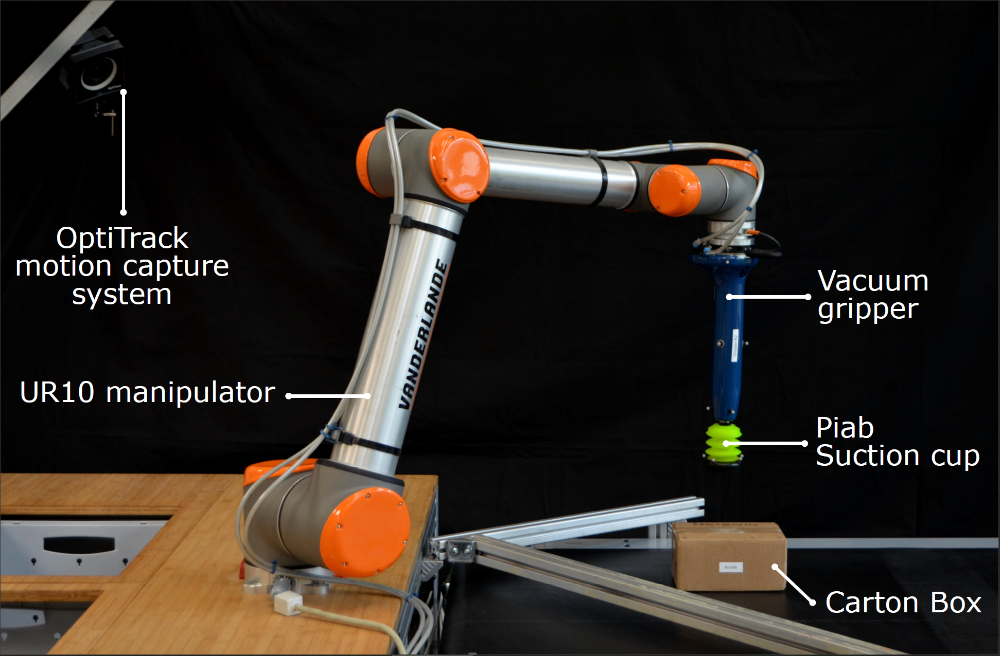
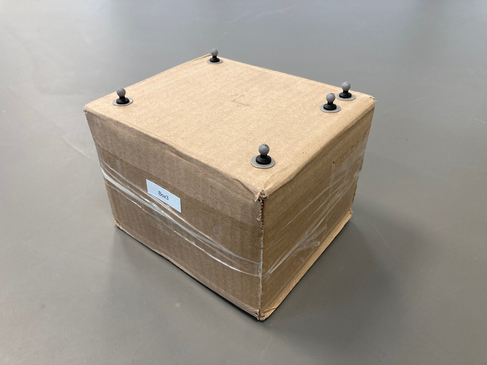
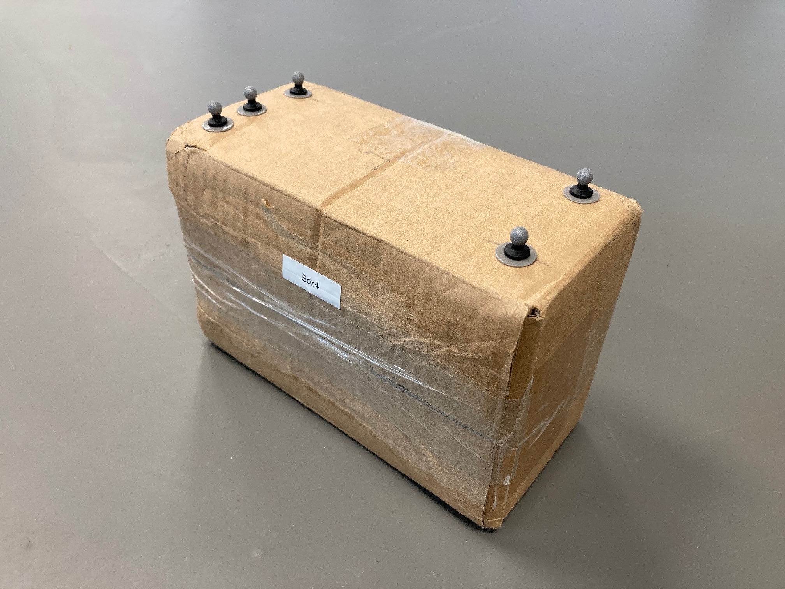
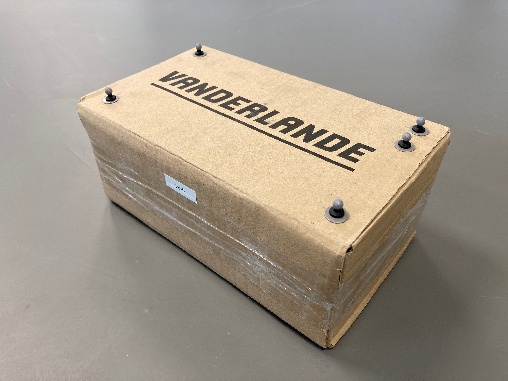
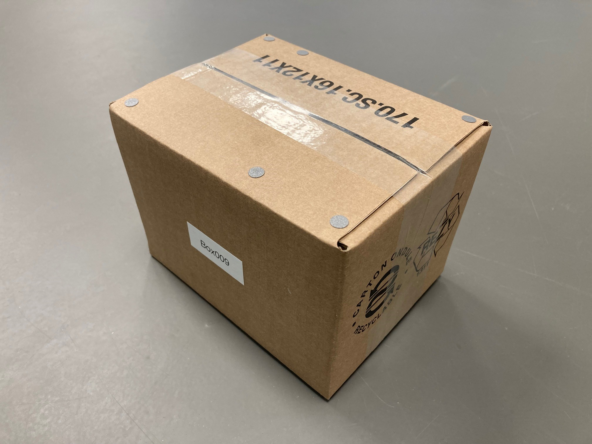

<div align="center">
<h1 align="center">
Parameter Identification and Validation of Nonsmooth Impact Models
with Friction
</h1>
</div>
<div align="center">
<h3>
<a href="https://research.tue.nl/en/persons/maarten-jongeneel">Maarten Jongeneel</a>,
<a href="https://research.tue.nl/en/persons/luuk-poort">Luuk Poort</a>,
<a href="https://www.tue.nl/en/research/researchers/nathan-van-de-wouw/">Nathan van de Wouw</a>,
<a href="https://www.tue.nl/en/research/researchers/alessandro-saccon/">Alessandro Saccon</a>
<br>
<br>
Conference TBD
<br>
<br>
<!-- <a href="https://hal.archives-ouvertes.fr/hal-03740751v1">[Early Paper on HAL]</a> -->
</h3>
</div>

If you are using this paper as reference, please refer to it as
<!-- ```bibtex
@inproceedings{Lubbers2022_LearningSuction,
    author = {M Lubbers J van Voorst M J Jongeneel and A Saccon},
    title = {{Learning Suction Cup Dynamics from Motion Capture: Accurate Prediction of an Object's Vertical Motion during Release}},
    booktitle = {IEEE/RSJ International Conference on Intelligent Robots and Systems (IROS 2022)},
    year = {2022},
    month = {October}
}
``` -->
Requirements
===========
 - [1D_Archive.h5](https://doi.org/10.4121/20536569/) Raw data file 

Introduction
============

The content of this repository is associated to the paper "Parameter Identification and Validation of Nonsmooth Impact Models with Friction". The objective for this project is to empirically evaluate the prediction performance of commonly used impact models. To this end, first a parameter identification approach is used to identify (from experimental data) the coefficients of friction and restitution of the objects that are used in experiments. Second, once these parameters are known, the prediction capabilities of these models are tested on a different experimental dataset. 

This project is part of the European project [I.AM.](www.i-am-project.eu) on Impact Aware Manipulation under the scenario of TOSS. 


Table of content
================
- [Overview](#overview)
- [Installation](#installation)
- [Usage of the scripts](#usage-of-the-scripts)
- [Contact](#contact)

# Overview
The code in this repository can be split into two main parts. The first part focusses on parameter identification and the second part focusses on the long-horizon prediction performance. Experiments are executed to obtain datasets for identification and performance analysis on the setup shown below.

<div align="center">
<div style = "display: flex; align="center">
 
</div>
</div> 

In the experiments, different objects are used. Below, the different boxes are shown. From left to right: Box003, Box004, Box005, Box006, Box007, and Box009. Detailed information about the objects can be found on the [Impact-Aware Robotics Database](https://impact-aware-robotics-database.tue.nl/objects).

<div style = "display: flex; align="center">
 





</div>

The experiments for parameter identification are stored in Archives. The archive containing box-impact experiments for Box003, Box004, and Box005 can be found [here](https://doi.org/10.4121/17122553). 

<p>&nbsp;</p>

## Part 1: Parameter identification
In the models used, the coefficient of friction (COF) and coefficient of restitution (COR) need to be identified, as they differ per object/environment combination. There are two metrics that are used for the identification of the parameters. The first metric is a *velocity based* metric, where the loss function is based on a comparison between predicted and measured post-impact velocity, given a pre-impact object state. The second metric is a *trajectory based* metric, where the loss function is based on a comparison between a measured and simulated trajectory, and the optimum parameters are the ones that minimize this error.  

# Installation
The code of this repository is all written in MATLAB and can directly be pulled from this repository. 

# Usage of the scripts


# Contact
In case you have questions or if you encountered an error, please contact us through the "Issues" functionality on GIT. 

# TODO
- [ ] Write a proper README.md
- [ ] Update `paramID/getImpactData.m`
    - [ ] Make the object you want to use for paramID as input, get rid of hardcoded stuff
    - [ ] Also consider gravity, and impact surface
- [ ] Update paramID subdirectory
    - [ ] Clean up the scripts
    - [X] Make Param ID for AGX optional 
    - [ ] Make scripts for paramID in MuJoCo
    - [ ] Write proper README.md for that subdirectory
- [ ] Update the rest-pose prediction scripts
    - [ ] Make simulations in AGX optional (s.t. one can run also only Matlab)
    - [ ] Create options for MuJoCo simulation and validation scripts
    - [ ] Write proper script to evaluate rest-pose on the conveyor of certain (input) object (e.g., box5)
    - [ ] Write proper script to evaluate pick-up on the (input) object (e.g., box5)


