<div align="center">
<h1 align="center">
Experimental Validation of Nonsmooth Dynamics Simulations for
Robotic Tossing involving Friction and Impacts
</h1>
</div>
<div align="center">
<h3>
<a href="https://research.tue.nl/en/persons/maarten-jongeneel">Maarten Jongeneel</a>,
<a href="https://research.tue.nl/en/persons/luuk-poort">Luuk Poort</a>,
<a href="https://www.tue.nl/en/research/researchers/nathan-van-de-wouw/">Nathan van de Wouw</a>,
<a href="https://www.tue.nl/en/research/researchers/alessandro-saccon/">Alessandro Saccon</a>
<br>
<br>
IEEE Transactions on Robotics (T-RO)
<br>
<br>
<a href="https://hal.science/hal-03974604">[Early Paper on HAL]</a>
</h3>
</div>

# 

If you are using this paper as reference, please refer to it as
```bibtex
@article{Jongeneel2022_ExperimentalValidation,
    author = {M J Jongeneel and L Poort and N van de Wouw and A Saccon},
    title = {{Experimental Validation of Nonsmooth Dynamics Simulations for Robotic Tossing involving Friction and Impacts}},
    journal = {IEEE Transactions on Robotics (T-RO)},
    year = {2023},
}
```
# Requirements
## Software
- [Matlab](https://www.mathworks.com/products/matlab.html) (main scripts)
- [Python](https://www.python.org/) (simulations for PyBullet)
- [Algoryx Dynamics](https://www.algoryx.se/agx-dynamics/) (simulations)

## Datasets
The following datasets are required to run the code. They can be downloaded via the links below and should be placed in the [data](/data/) folder. 
 - [Archive_003_BoxDrops.h5](https://doi.org/10.4121/17122553) : Archive used for velocity based parameter identification of Box005.
 - [Archive_005_ParamID_Box006.h5](https://doi.org/10.4121/21024007) : Archive used for velocity based parameter identification of Box006 
 - [Archive_008_Box006_ParamID_Traj.h5](https://doi.org/10.4121/21387510) : Archive used for trajectory based parameter identification of Box006
 - [Archive_009_Box005_Repeatability.h5](https://doi.org/10.4121/21387606) : Archive used for trajectory based parameter identification of Box005
 - [Archive_011_Box005Box006_Validation](https://doi.org/10.4121/21399657) : Archive containing experiments for validation of tosses with Box005 and Box006 on stationary and running conveyor

 The archives related to other boxes (e.g., Box004, Box007) can be found at the collection: [Data underlying the publication: Validating Rigid-Body Dynamics Simulators on Real-World Data for Robotic Tossing Applications](https://doi.org/10.4121/c.6278310). 


Introduction
============

The content of this repository is associated to the paper "Parameter Identification and Validation of Nonsmooth Impact Models with Friction". The objective for this project is to empirically evaluate the prediction performance of commonly used nonsmooth rigid-body dynamics simulators. To this end, first a parameter identification approach is used to identify (from experimental data) the coefficients of friction and restitution of the objects that are used in experiments. Second, once these parameters are known, the prediction capabilities of these models are tested on different experimental datasets. 

This project is part of the European project [I.AM.](www.i-am-project.eu) on Impact Aware Manipulation under the scenario of TOSS. 


Table of content
================
- [Overview](#overview)
- [Installation](#installation)
- [Usage of the scripts](#usage-of-the-scripts)
- [Contact](#contact)

# Overview
The code in this repository can be split into two main parts. The first part focusses on parameter identification and the second part focusses on the long-horizon prediction performance. Experiments are executed to obtain datasets for identification and performance analysis on the setup shown in Figure 1.

<div align="center">
    <div style = "display: flex; align="center">
        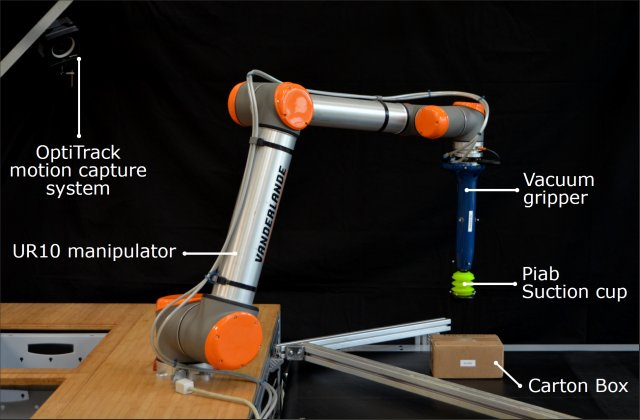 
    </div>
    <p>Figure 1: Picture of the experimental setup.</p>
</div> 

In the experiments, different objects are used. In Figure 2, the different boxes are shown. Detailed information about the objects can be found on the [Impact-Aware Robotics Database](https://impact-aware-robotics-database.tue.nl/objects).

<div align="center">
    <div style = "display: flex; align="center">
        
        
        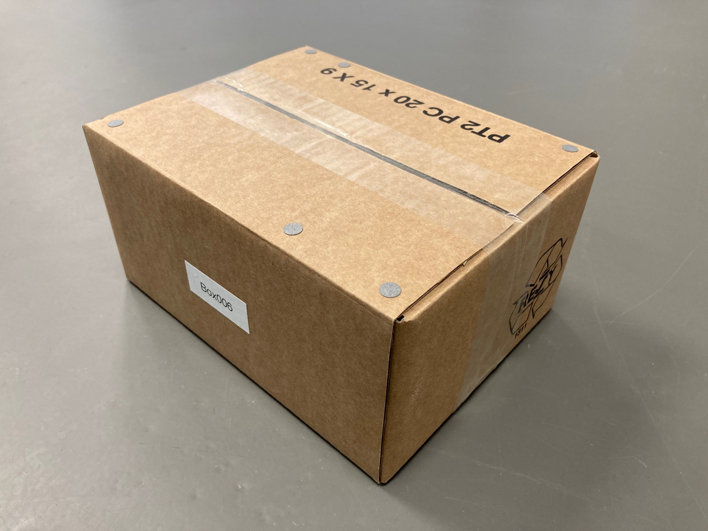
        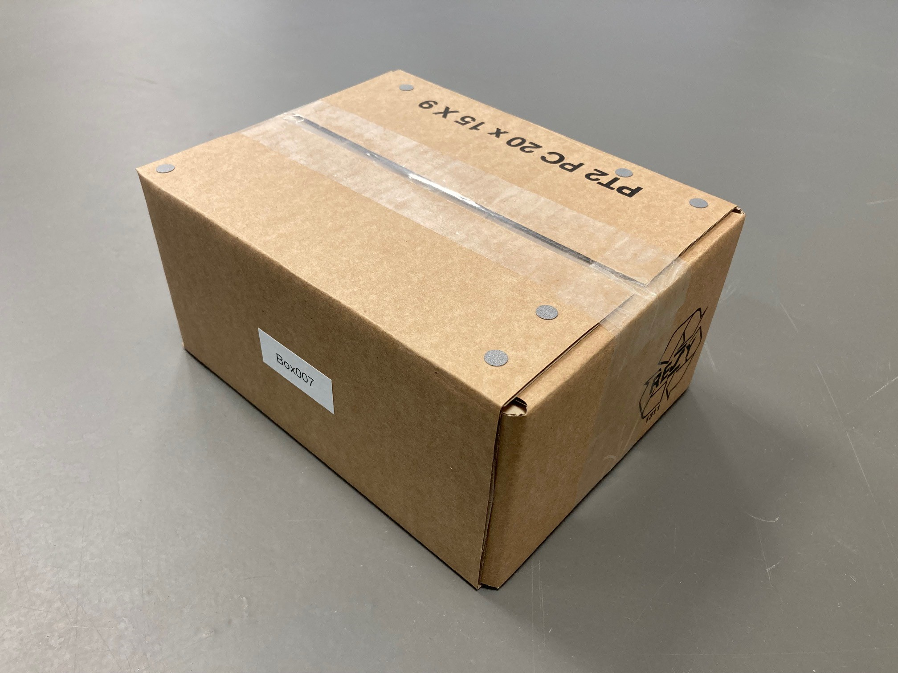
    </div>
    <p>Figure 2: The different boxes used in experiments. From left to right: Box004, Box005, Box006, and Box007.</p>
</div>


<p>&nbsp;</p>

## Part 1: Parameter identification
In the models used, the coefficient of friction (COF) and coefficient of restitution (COR) need to be identified, as they differ per object/environment combination. There are two metrics that are used for the identification of the parameters. The first metric is a *velocity based* metric, where the loss function is based on a comparison between predicted and measured post-impact velocity, given a pre-impact object state. This means we write the loss as 

 ```math
 L_{vel}(i;\mu,e_N) = \bigg\|\mathbf{W} \left(\mathbf{v}^{+} -	\tilde{\mathbf{v}}^{+}(e_N,\mu)\right)\bigg\|_2.
 ```

In Figure 3, one can see the resulting costs for simulations with Algoryx Dynamics (left) and MATLAB (right), for experiments with Box006. The cost functions show a clear minimum. 

<div align="center">
    <div style = "display: flex; align="center">
        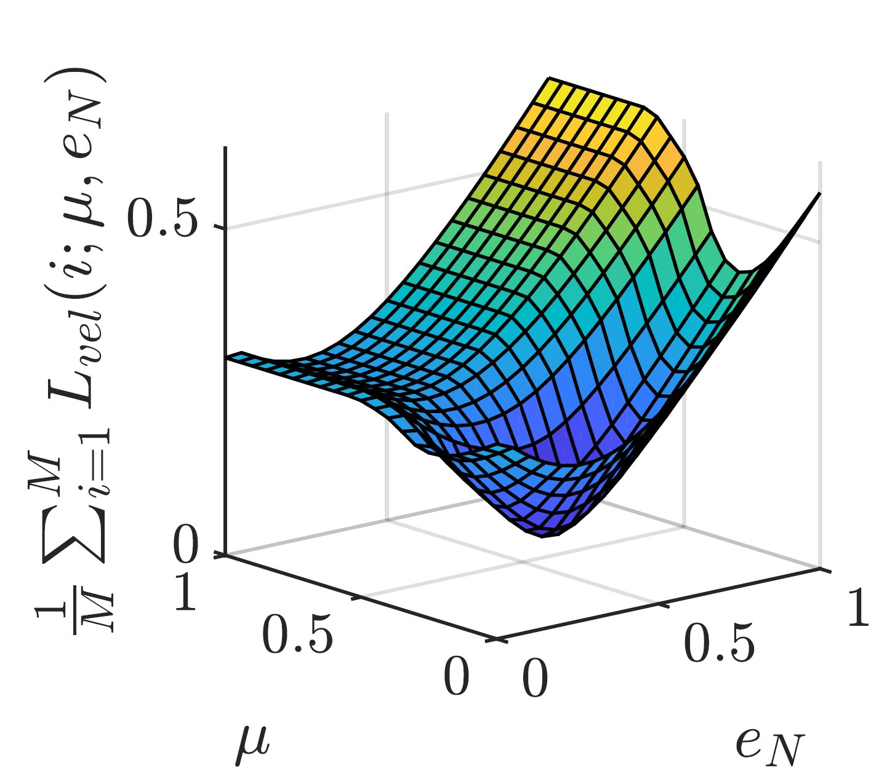
        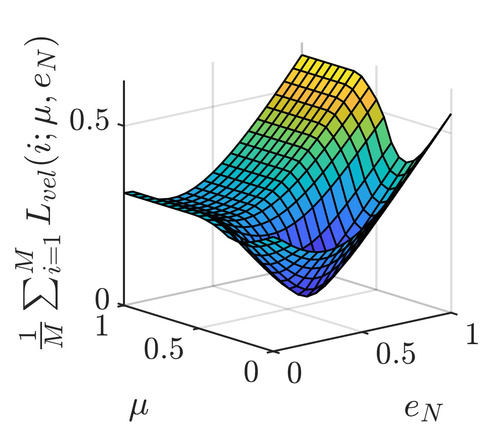
    </div>
    <p>Figure 3: Velocity based cost of Algoryx (left) and MATLAB (right).</p>
</div>


 The second metric is a *trajectory based* metric, where the loss function is based on a comparison between a measured and simulated trajectory, and the optimum parameters are the ones that minimize this error. This means we write the loss as

 ```math
 {L_{traj}(\mathbf{x}(k_{rel}:k_{rest})_i, \mu,e_N) = \frac{1}{N}\sum_{k=k_{rel}}^{k_{rest}} \big(\frac{1}{l}\|\mathbf{o}_i(k)-\tilde{\mathbf{o}}_i(k)\|_2 + \|\log\big(\mathbf{R}_i^{-1}(k)\tilde{\mathbf{R}}_i(k)\big)\|_2\big)}
 ```
 
 As a result, Figure 3 shows the costs for simulations with Algoryx Dynamics (left) and MATLAB (right), for experiments with Box006. Here, the costs do not show a clear minimum, as there appears to be an insensitivity to  $e_N$. The optimum parameters for different boxes via velocity based and trajectory based parameter identification are shown in Table 1.
 
 <div align="center">
    <div style = "display: flex; align="center">
        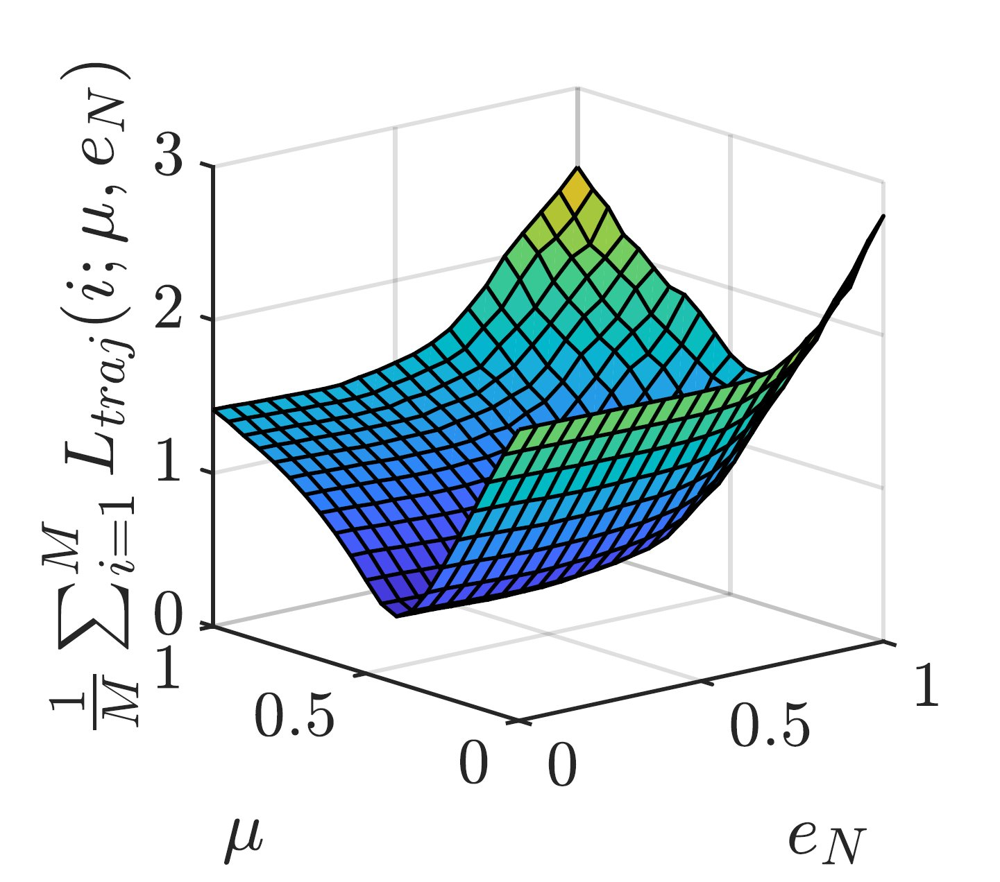
        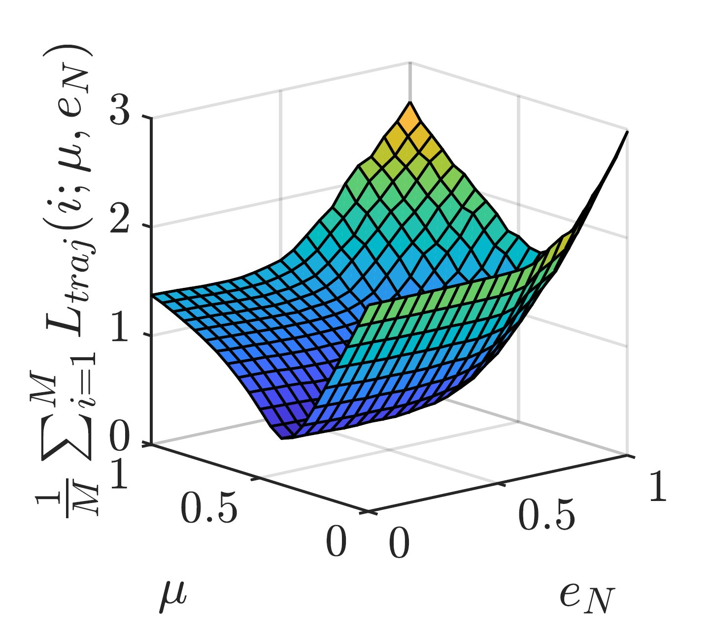
    </div>
    <p>Figure 3: Trajectory based cost of Algoryx (left) and MATLAB (right).</p>
</div>

<div align="center">
    <div style = "display: flex; align="center">
        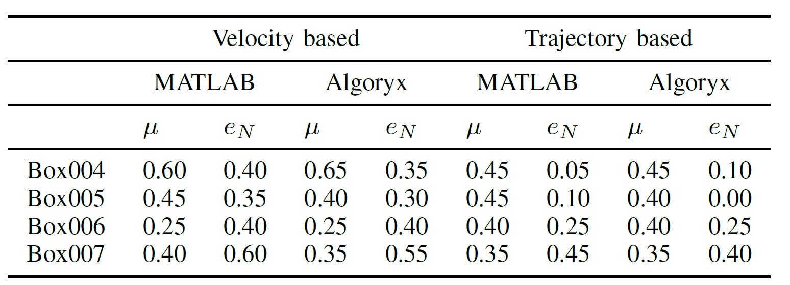
    </div>
    <p>Table 1: Resulting parameters for different boxes via velocity based and trajectory based parameter identification.</p>
</div>
 
 The optimum paramters are then used in simulation to evaluate the prediction performance. The code for parameter identification can be found in the [paramID](/paramID/) folder. Details about the approach can be found in the paper.


## Part 2: Prediction performance
With the optimum paramters at hand, we can evaluate the prediction performance of the different simulators. To do so, for each experiment, we define a moment of release of the box and the moment of rest. See Figure 4 for an indication. 

 <div align="center">
    <div style = "display: flex; align="center">
        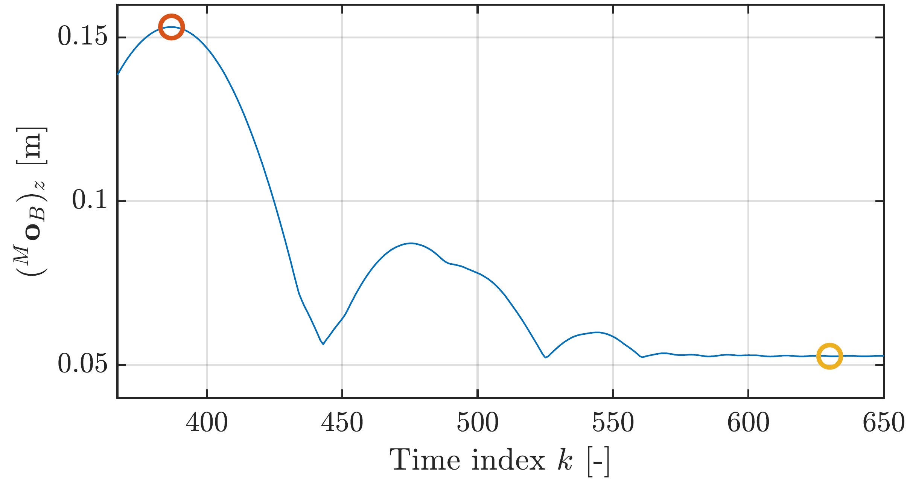
        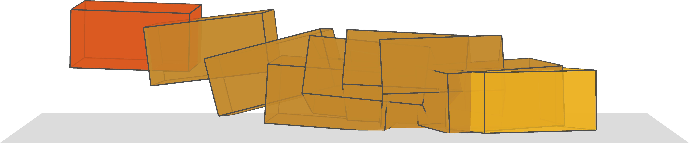
    </div>
    <p>Figure 4: Defining the moment of release and the moment of rest. Height of the object (left) and 3D plotted trajectory (right).</p>
</div>

We use the state of the object at the moment of release, together with the optimum paramters $\mu$ and $e_N$ as input to the simulations and simulate until the moment of rest. Then, we compare the simulated rest-pose with the measured rest-pose of the object. In Figure 5, we have plotted the resulting rest-poses for the velocity based parameters on Box005 (a), (b), (c),  results of velocity-based parameters on Box006 (d),(e),(f), results of trajectory based parameters on Box005 (g),(h),(i), results of trajectory-based parameters on Box006 (j),(k),(l).

 <div align="center">
    <div style = "display: flex; align="center">
        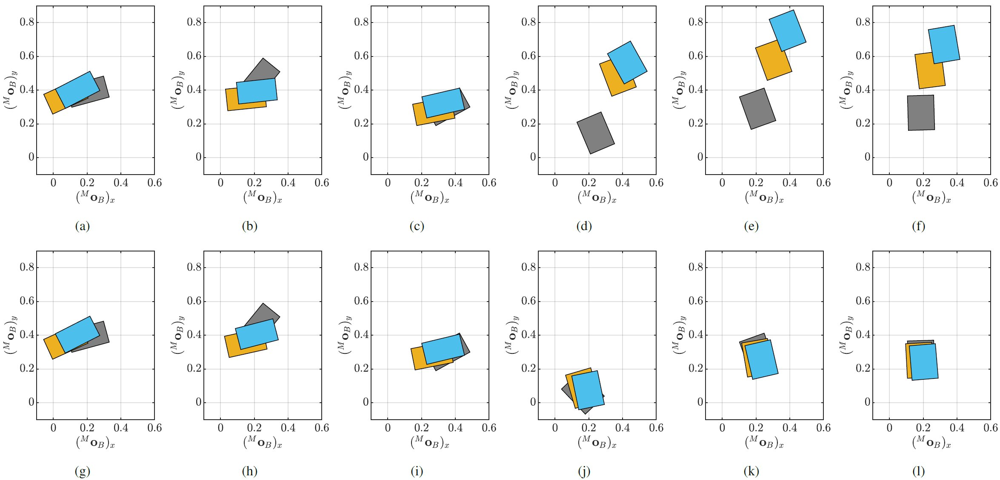
    </div>
    <p>Figure 5: Resulting rest-poses of three random selected experiments with Box005 and Box006. Details in the paper.</p>
</div>

The predictability performance of the simulators is measured
in terms of the rest-pose error. These errors show,
considering the parameters obtained via the trajectory based
cost function, a position error in the order of 5-10 cm, and a
orientation error in the order of 8-16 degrees over a tossing
trajectory of about 1.2 meters, with boxes whose maximum
dimension is about 20cm. These errors are, considering the
application at hand, rather small, and suggest that nonsmooth
dynamics models can indeed be used to predict the rest-pose of
box-tosses in logistics.


# Installation
The code of this repository is all written in MATLAB and can directly be pulled from this repository. The datasets as written under [Requirements](#requirements) should be downloaded and placed in the [data](/data/) folder.


# Contact
In case you have questions or if you encountered an error, please contact us through the "Issues" functionality on GIT. Alternatively you can send an email to [Maarten Jongeneel](mailto:m.j.jongeneel@tue.nl).

<!-- # TODO
- [ ] Write a proper README.md
- [ ] Update `paramID/getImpactData.m`
    - [ ] Make the object you want to use for paramID as input, get rid of hardcoded stuff
    - [ ] Also consider gravity, and impact surface
- [ ] Update paramID subdirectory
    - [ ] Clean up the scripts
    - [X] Make Param ID for AGX optional 
    - [ ] Write proper README.md for that subdirectory
- [ ] Update the rest-pose prediction scripts
    - [ ] Make simulations in AGX optional (s.t. one can run also only Matlab)
    - [ ] Create options for MuJoCo simulation and validation scripts
    - [ ] Write proper script to evaluate rest-pose on the conveyor of certain (input) object (e.g., box5)
    - [ ] Write proper script to evaluate pick-up on the (input) object (e.g., box5) -->


